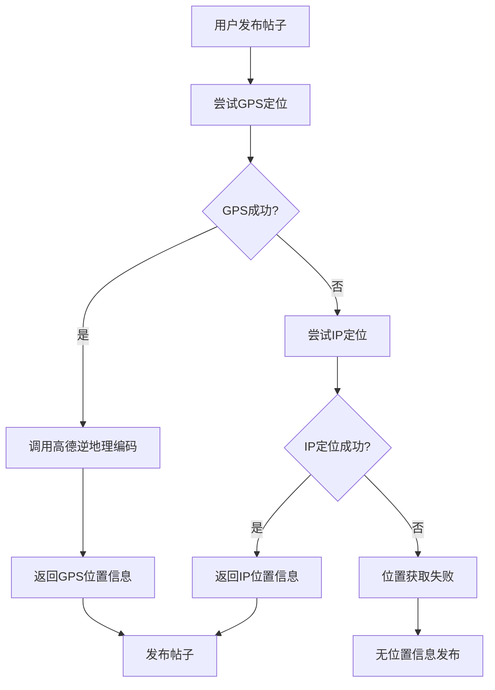

# 位置信息功能

## 功能概述

为帖子发布添加了位置信息功能，用户发布帖子时会自动获取并显示所在省份信息。

## 功能特性

### 🎯 自动位置获取
- **GPS定位优先**：首先尝试使用浏览器的地理位置API获取精确位置
- **IP定位备用**：GPS失败时自动切换到IP定位
- **用户友好**：获取失败时不影响正常发布功能

### 📍 位置显示
- **发布时显示**：在发布框中显示当前位置
- **帖子列表显示**：在帖子作者信息旁显示发布地点
- **格式化显示**：智能处理直辖市等特殊情况

### 🔒 隐私保护
- **仅显示省份**：默认只显示省份信息，保护用户隐私
- **可选功能**：位置获取失败不影响发布
- **精确坐标存储**：后端存储精确坐标但前端不显示

## 技术实现

### 数据库模型
```sql
-- Post表新增字段
ALTER TABLE "Post" ADD COLUMN "province" TEXT;
```

### 前端实现
```typescript
// 位置服务
import { getUserLocation, formatLocationText } from "@/lib/locationService";

// 获取位置
const location = await getUserLocation();

// 发布时包含位置信息
const postData = {
  content,
  tags,
  images,
  location, // 位置信息
};
```

### 后端API
```typescript
// 接收位置信息
const { title, content, tags, images, location } = await request.json();

// 存储到数据库
const post = await prisma.post.create({
  data: {
    // ... 其他字段
    province: location?.province || null,
  },
});
```

## 配置说明

### 环境变量
在 `.env.local` 文件中添加：
```bash
# 高德地图API密钥
NEXT_PUBLIC_AMAP_API_KEY=your-amap-api-key
```

### 获取高德地图API密钥
1. 访问 [高德开放平台](https://lbs.amap.com/)
2. 注册并创建应用
3. 选择"Web服务API"
4. 获取API Key

## 位置获取流程



## 使用示例

### 发布帖子时
```typescript
// 自动获取位置
useEffect(() => {
  const getLocation = async () => {
    try {
      const userLocation = await getUserLocation();
      setLocation(userLocation);
    } catch (error) {
      console.warn('获取位置失败:', error);
    }
  };
  getLocation();
}, []);

// 显示位置信息
{location && (
  <div className="flex items-center gap-1 text-xs text-gray-500">
    <LocationIcon />
    <span>{formatLocationText(location)}</span>
  </div>
)}
```

### 帖子列表显示
```typescript
{post.province && (
  <div className="flex items-center gap-1 text-gray-400 text-xs">
    <LocationIcon />
    <span>{post.province}</span>
  </div>
)}
```

## 测试页面

访问 `/test-location` 页面可以测试位置功能：
- 测试GPS定位
- 测试IP定位
- 查看位置信息格式化结果

## 注意事项

### 🔒 HTTPS要求
- GPS定位在HTTPS环境下效果更好
- 本地开发时使用localhost可以正常工作

### 🌐 浏览器兼容性
- 现代浏览器都支持地理位置API
- 用户可能拒绝位置权限

### 📱 移动端优化
- 移动端GPS定位更准确
- 考虑电池消耗和隐私

### 🚀 性能优化
- 位置信息有5分钟缓存
- 超时时间设置为10秒
- 失败时不阻塞发布流程

## 未来扩展

### 可能的功能扩展
- [ ] 用户可选择是否显示位置
- [ ] 支持手动选择位置
- [ ] 基于位置的帖子筛选
- [ ] 附近的人功能
- [ ] 位置热力图

### 隐私增强
- [ ] 位置模糊化选项
- [ ] 历史位置清理
- [ ] 更细粒度的隐私控制
